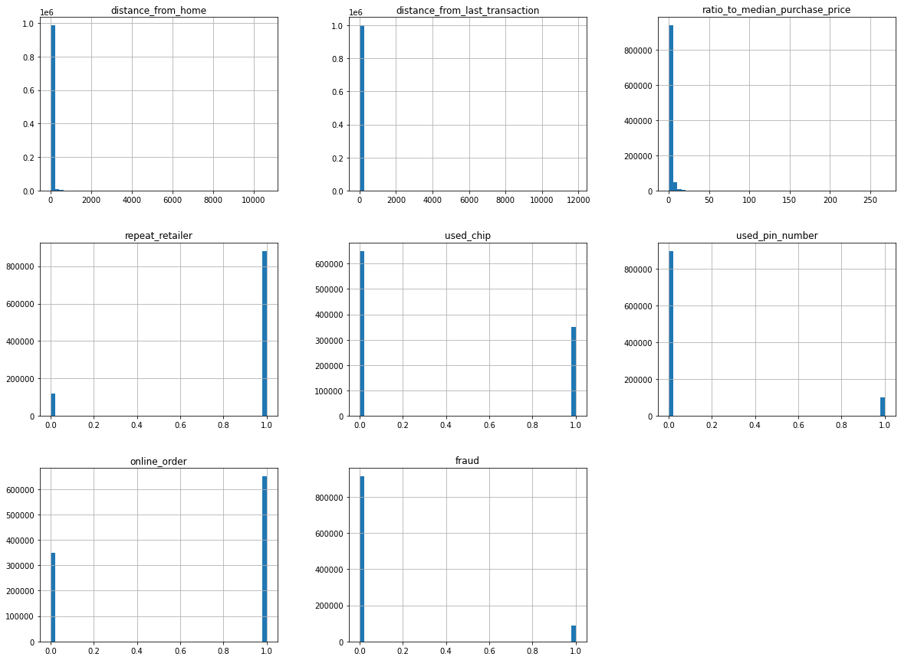
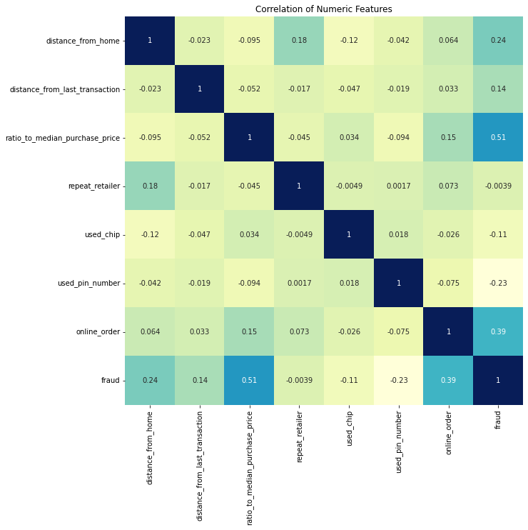
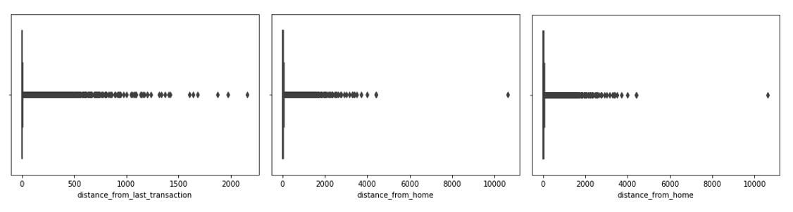

# Credit Card Fraud Detection - Nathanael Victor Darenoh

## Domain Proyek

Pembayaran digital terus berkembang, begitu juga kejahatan cyber yang kerap mengikuti. Penipuan yang berhubungan dengan keuangan (Financial Fraud) merupakan ancaman yang terus berkembang dan berbahaya. Ketergantungan pada teknologi dan dunia digital telah membuat meningkatnya penggunaan transaksi dengan kartu kredit.Sehingga kartu kredit menjadi salah satu metode pembayaran yang paling umum baik saat bertransaksi secara online maupun offline sekarang ini. Namun hal tersebut jugalah yang membuat tingkat penipuan kartu kredit ini juga kian meningkat. Oleh sebab itu, banyak lembaga atau perusahaan mulai memfokuskan perhatiannya pada metodologi komputasi terkini untuk menangani masalah penipuan kartu kredit ini. Dengan membuat deteksi penipuan kartu kredit menggunakan metode machine learning, harapannnya dapat mengurangi terjadinya penipuan dengan kartu kredit ini.

Referensi: [Credit card fraud detection using machine learning techniques: A comparative analysis](https://ieeexplore.ieee.org/abstract/document/8123782)

## Business Understanding

### Problem Statements

- Penipuan kartu kredit di tengah perkembangan pembayaran digital yang sedang marak terjadi
- Melakukan analisis perbandingan komparatif antara algoritma Logistic Regression dan Naive Bayes dalam menyelesaikan masalah klasifikasi biner (binary classification)

### Goals

Menjelaskan tujuan dari pernyataan masalah:

- Membuat deteksi penipuan kartu kredit guna mengurangi kemungkinan terjadinya penipuan kedepannya
- Mengetahui algoritma yang baik dan efisien untuk menyelesaikan masalah klasifikasi biner penipuan kartu kredit

### Solution statements

- Mengajukan dua algoritma yaitu Naive Bayes dan Logistic Regression, kemudian melakukan perbandingan untuk mencapai model yang diinginkan dan sesuai dengan kebutuhan
- Untuk evaluasi model, model akan diuji dan diukur dengan metrik evaluasi akurasi, precision, recall dan F1 score dengan bantuan library sklearn.

## Data Understanding

Data penipuan kartu kredit ini saya ambil dari situs kaggle. Untuk tautannya dapat diakses di [Credit Card Fraud](https://www.kaggle.com/datasets/dhanushnarayananr/credit-card-fraud/metadata). Selanjutnya, adapun penjelasan fitur sebagai berikut:

### Variabel-variabel pada Restaurant UCI dataset adalah sebagai berikut:

- distance_from_home : mepresentasikan jarak dari rumah ke tempat dimana transaksi dilakukan (0.004874 - 10632.723672)
- distance_from_last_transaction : mempresentasikan jarak dari tempat terakhir dilakukannya transaksi (0.000118 - 11851.104565)
- ratio_to_median_purchase_price : mempresentasikan rasio transaksi dengan median harga beli (0.004399 - 267.802942)
- repeat_retailer : apakah transaksi terjadi dari retail yang sama (0: tidak, 1: iya)
- used_chip : apakah transaksi melalui chip kartu kredit (0: tidak, 1: iya)
- used_pin_number : apakah transaksi tersebut menggunakan nomor pin (0: tidak, 1: iya)
- online_order : apakah transaksi tersebut merupakan pesanan online (0: tidak, 1: iya)
- fraud : apakah transaksi tersebut termasuk penipuan (fraud) (0: tidak, 1: iya)

### Exploratory Data Analysis

#### Menangani Missing Values

Pada data tersebut, saya melakukan pengecekan nilai duplikasi, dan nilai null. Saya juga melakukan pengecekan nilai yang anomali pada data jenis boolean dan hasilnya aman atau sudah bersih. Namun, saya menemukan outlier atau anomali data pada data jenis numerikal kontinyu (distance_from_home, distance_from_last_transaction dan ratio_to_median_purchase_price). Disini saya tidak langsung menghilangkan outlier tersebut dikarenakan terjadi imbalance data pada fitur target yaitu fraud, sehingga apabila saya menghilangkan outlier maka data kelas minoritas fitur fraud akan terhapus semua.

#### Univariate Analysis

Disini saya menampilkan histogram untuk mengetahui distribusi data di setiap fitur.



Dari histogram tersebut, saya mendapatkan beberapa informasi, antara lain:

- Distribusi data numerikal kontinyu (distance_from_home, distance_from_last_transaction dan ratio_to_median_purchase_price) miring ke kanan atau right-skewed. Hal ini akan berimplikasi pada model sehingga lebih baik dilakukan normalisasi nantinya.
- Distribusi data target fraud tidak seimbang (imbalance data) sehingga ada baiknya dilakukan undersampling. Menurut laman yang saya baca di [Imbalanced Data](https://developers.google.com/machine-learning/data-prep/construct/sampling-splitting/imbalanced-data), derajat ketidakseimbangan kelas minoritasnya pada dataset saya berada pada "moderate" sehingga saya memutuskan untuk melakukan undersampling.

#### Undersampling

Saya akan melakukan "Random Under Sampling" dengan menghilangkan data pada kelas mayoritasnya sehingga distribusi datanya bisa lebih seimbang (Saya mempelajari beberapa teknik ini dari [Dealing with Imbalanced Datasets](https://www.kaggle.com/code/janiobachmann/credit-fraud-dealing-with-imbalanced-datasets/notebook#Test-Data-with-Logistic-Regression:)). Sebelum melakukan undersampling, saya memisahkan dengan dataset aslinya terlebih dahulu. Hal ini dilakukan karena nantinya pada tahap evaluasi model, saya akan menguji model dengan dataset aslinya bukan dataset yang dibuat dengan teknik undersampling. Tujuannya adalah untuk menyesuaikan model dengan kerangka dataset sebelum dilakukan undersample atau oversample dan dapat mendeteksi pola lebih baik pada set pengujian dataset asli.

Setelah memisahkan dengan dataset aslinya menggunakan train test split, saya kemudian mengambil semua data dari fitur fraud yang bernilai 1. Saya juga mengambil data dari fraud bernilai 0 dengan menyesuaikan jumlah data dari fitur fraud yang bernilai 1. Saya menggunakaan source code seperti dibawah ini:

```
fraud_df = df.loc[df['fraud'] == 1]
non_fraud_df = df.loc[df['fraud'] == 0][:fraud_1]
```

Setelah itu, saya melakukan penggabungan menjadi dataset yang baru setelah dilakukan undersampling.

```
normal_distributed_df = pd.concat([fraud_df, non_fraud_df])

new_df = normal_distributed_df.sample(frac=1, random_state=42)
new_df.head()
```

Setelah melakukan undersampling, distribusi data target fraud sudah seimbang, kemudian barulah saya melakukan pembersihan data lebih lanjut dengan menghilangkan outlier. Untuk proses menghilangkan outlier, saya hanya menghilangkan beberapa data dari kuantil terakhir. Hal ini dikarenakan data dari kuantil terakhir tersebut memiliki nilai yang sangat jauh dibanding kumpulan data lainnya.

#### Multivariate Analysis

Disini saya menampilkan heatmap untuk mengetahui korelasi dari setiap fitur.



Dari heatmap diatas, saya mendapatkan informasi bahwa fitur repeat_retailer memiliki korelasi sangat rendah dengan fitur target yaitu fraud. Sehingga, fitur repeat_retailer akan saya drop.

## Data Preparation

Pada bagian ini, saya melakukan dua tahap persiapan data, yaitu:

1. Data Cleaning

Data cleaning melibatkan perbaikan masalah sistematis atau kesalahan dalam data yang "noisy" atau berantakan. Dalam tahap ini, saya terlebih dahulu melakukan pengecekan antara lain:

- duplikasi data, hasilnya tidak ada sama sekali
- null atau missing value, hasilnya tidak ada sama sekali
- outlier, hasilnya saya menemukan outlier pada fitur distance_from_home, distance_from_last_transaction, dan ratio_to_median_purchase_price.

Berikut outlier yang saya temukan dari fitur-fitur tersebut.


Dari boxplot tersebut, dapat diperoleh informasi bahwa terdapat beberapa nilai yang terlalu jauh dari distribusi nilai normalnya. Untuk itu, saya hanya menghilangkan nilai-nilai terakhir (dari quantile terakhir) sehingga distribusi nilainya dapat menjadi lebih baik dan tidak menghilangkan terlalu banyak data. Oleh sebab itu, saya akan menggunakan metode iqr namun menggunakan batas bawah mulai quantile=0 dan batas atas pada quantile=0.99.

2. Pembagian dataset dengan fungsi train_test_split

Membagi dataset menjadi data latih dan data uji dengan proporsi pembagian 80:20. Tujuannya adalah agar tidak mengotori data uji dengan informasi yang didapat dari data latih. Namun disini terdapat sedikit perbedaan. Untuk data ujinya, saya akan menggunakan data uji dari dataset aslinya yaitu dataset sebelum dilakukan undersampling ataupun oversampling.

3. Normalisasi

Normalisasi adalah mengubah nilai fitur agar berada dalam interval terbatas (min dan maks). Disini saya melakukan normalisasi pada fittur numerik kontinu (distance_from_home, distance_from_last_transaction dan ratio_to_median_purchase_price) karena nilai pada fitur tersebut memiliki rentang yang sangat jauh sebagai contohnya pada fitur distance_from_home memiliki rentang fitur antara 0.004874 - 10632.723672. Oleh sebab itu, disini saya menggunakan algoritma minmax untuk melakukan normalisasi dengan bantuan library sklearn. MinMaxScaler melakukan proses normalisasi fitur dengan mengubah nilai fitur ke rentang tertentu (misalnya disini saya menggunakan rentang diantara nol dan satu). Normalisasi ini saya lakukan pada new_x_train (fitur train data setelah dilakukan undersampling) dan x_test (fitur test data sebelum dilakukan undersampling).

## Modeling

Pada bagian ini, saya mengembangkan model machine learning dengan dua algoritma, yaitu Naive Bayes dan Logistic Regression. Saya menggunakan dua algoritma tersebut tanpa melakukan improvement apapun. Berikut penjelasan dan hasil lebih lanjut tentang algoritma yang digunakan:

1. Naive Bayes Classifier

Naïve Bayes Classifier merupakan sebuah metode klasifikasi yang didasarkan pada teorema Bayes yang memilih keputusan berdasarkan probabilitas tertinggi. Teorema Bayes menggunakan metode probabilitas dan statistik untuk memprediksi peluang di masa depan (nilai yang tidak diketahui) berdasarkan pengalaman di masa sebelumnya (nilai yang diketahui). Teknik ini memiliki ciri utama adalah asumsi yg sangat kuat akan independensi dari masing-masing kondisi (fitur-fitur pada data). Klasifikasi Naive Bayes didasarkan pada probabilitas bersyarat seperti dibawah ini:

- $$P(c_{i} | f_{k}) = \frac{P(f_{k} | c_{i}) * P(c_{i})}{P(f_{k})}$$
- $$P(f_{k} | c_{i}) = \prod^n_{i = 1}{P(f_{k} | c_{i}) k = 1,..,n;i=1,2}$$

dimana n mempresentasikan jumlah fitur, $P(c_{i} | f_{k})$ adalah probabilitas nilai fitur $f_{k}$ berada di kelas suatu class ($c_{i}$), $P(f_{k} | c_{i})$ adalah probabilitas menghasilkan nilai fitur $f_{k}$ yang diberikan oleh suatu class ($c_{i}$). $P(c_{i})$ dan $P(f_{k})$ adalah peluang munculnya kelas ci dan probabilitas nilai fitur fk yang terjadi pada tiap fitur. Kemudian classifier akan melakukan klasifikasi biner berdasarkan aturan bayesian ini:

- $$If P(c_{1} | f_{k}) > P(c_{2} | f_{k}) \text{maka diklasifikasikan} C_{1}$$
- $$If P(c_{2} | f_{k}) > P(c_{1} | f_{k}) \text{maka diklasifikasikan} C_{2}$$

dimana $C_{1}$ adalah kelas 0 atau bukan penipuan (transaksi tidak fraud) sedangkan $C_{2}$ adalah kelas 1 atau penipuan (transaksi fraud).

Kelebihan:

- Bisa dipakai untuk data kuantitatif maupun kualitatif
- Tidak perlu melakukan data training yang banyak
- Jika ada nilai yang hilang, maka bisa diabaikan dalam perhitungan.
- Pengklasifikasian dokumen bisa dipersonalisasi, disesuaikan dengan kebutuhan setiap orang
- Bisa digunakan untuk klasifikasi masalah biner ataupun multiclass

Kekurangan:

- Asumsi bahwa masing-masing variabel independen membuat berkurangnya akurasi, karena biasanya ada korelasi antara variabel yang satu dengan variabel yang lain
- Keakuratannya tidak bisa diukur menggunakan satu probabilitas saja. Butuh bukti-bukti lain untuk membuktikannya.

2. Logistic Regression Classifier (Model Terbaik)

Logistic Regression Classifier adalah algoritma yang menggunakan pendekatan fungsional untuk memperkirakan probabilitas output biner berdasarkan satu atau lebih variabel diskrit maupun kontinu.

Kelemahan dari Logistic Regression adalah rentan terhadap underfitting pada dataset yang kelasnya tidak seimbang. Namun kelemahannya ini cukup teratasi sehingga sebagai hasilnya dapat dilihat bahwa algoritma ini telah berhasil membuat model yang terbaik.

## Evaluation

Pada bagian evaluasi ini, saya akan menampilkan confusion matrix terlebih dahulu. Confusion matrix adalah tabel dengan 4 kombinasi berbeda dari nilai prediksi dan nilai aktual/ nilai sebenarnya. Represintasi dari confusion matrix dinyatakan dengan True Positif, True Negatif, False Positif, dan False Negatif.

Pada kasus ini, confusion matrix dinyatakan sebagai berikut:

- True Positif (TP) : kasus dimana transaksi diprediksi fraud (1.0) dan data sebenarnya fraud (1.0)
- True Negatif (TN) : kasus dimana transaksi diprediksi tidak fraud (0.0) data sebenarnya tidak fraud (0.0)
- False Positif (FP) : kasus dimana transaksi diprediksi fraud (1.0) namun data sebenarnya tidak fraud (0.0)
- False Negatif (FN) : kasus dimana transaksi diprediksi tidak fraud (0.0) data sebenarnya fraud (1.0)

Melalui confusion matrix tersebut, saya mengukur performa naive bayes dan logistic regression classifiers dengan mengevaluasi metrik akurasi, precision, recall dan F1 score dengan bantuan library sklearn.

$$Akurasi = \frac{TP + TN}{TP+FP+TN+FN}$$

$$Presisi = \frac{TP}{TP+FP}$$

$$Recall = \frac{TP}{TP+FN}$$

$$\text{F1-Score} = 2 *\frac{Recall*Presisi}{Recall+Presisi}$$

Dari hasil yang saya dapatkan, akurasi dengan Logistic Regression adalah 0.93 sedangkan akurasi dengan Naive Bayes adalah 0.88. Model dengan algoritma Logistic Regression juga memiliki hasil evaluasi lebih baik pada Presisi, Recall dan F1-Score sehingga dapat diambil kesimpulan bahwa algoritma Logistic Regression adalah algoritma terbaik dalam menyelesaikan permasalahan ini. Berikutnya, saya akan menjelaskan tahapan perhitungan performa pada model dengan Logistic Regression.

### Logistic Regression Evaluation

Confusion Matrix Logistic Regression


Melalui confusion matrix diatas, didapatkan informasi bahwa:

- True Positif (TP) : 16657
- True Negatif (TN) : 170203
- False Positif (FP) : 12354
- False Negatif (FN) : 786

Perhitungan performa berdasarkan akurasi, presisi, recall dan F1-score:

- Akurasi

  $$Akurasi = \frac{16657 + 170203}{16657 + 170203 + 12354 + 786} = 0.93$$

- Presisi

  $$\text{Presisi pada kelas 1} = \frac{16657}{16657 + 12354} = 0.57$$

  $$\text{Presisi pada kelas 0} = \frac{170203}{170203 + 786} = 0.995$$

- Recall

  $$\text{Recall pada kelas 1} = \frac{16657}{16657 + 786} = 0.95$$

  $$\text{Recall pada kelas 0} = \frac{170203}{170203 + 12354} = 0.93$$

- F1 Score

  $$\text{F1 Score pada kelas 1} = \frac{0.9555 * 0.57}{0.9555 + 0.57} = 0.72$$

  $$\text{F1 Score pada kelas 0} = \frac{0.9317 * 0.995}{0.9317 + 0.995} = 0.96$$

Sesuai perhitungan yang telah dilakukan diatas, hasilnya kurang lebih sama dengan classification report dibawah ini.

Classification Report Logistic Regression


